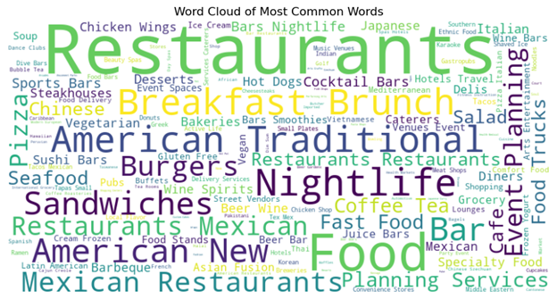

# Project Title
 Recommender Systems with NLP and Sentiment Analysis
 
# Project Overview
This project demonstrates the creation of a Recommender System using various Natural Language Processing (NLP) techniques, Sentiment Analysis, and Topic Modeling to enhance user recommendations. The goal is to analyze user reviews and build a recommendation system that leverages user preferences and text data insights.
# Techniques and Tools Used
- **Natural Language Processing (NLP)**: Preprocessing, tokenization, and word embeddings to understand and analyze textual reviews.
- **Sentiment Analysis**: Implemented to assess the sentiment of user reviews and incorporate that into the recommendation process.
- **Topic Modeling**: Used LDA (Latent Dirichlet Allocation) and NMF (Non-negative Matrix Factorization) for uncovering hidden topics in reviews.
- **Recommender System Models**: Collaborative filtering (both user-based and item-based) and content-based filtering approaches are explored.
- **Tools**: Python, Pandas, NLTK, Scikit-learn, LDA, NMF, RecommenderLab.
# How the Data is Processed
[Alt Text](Images\Stats.png)
 1. **Data Preprocessing**: 
   - Tokenized and cleaned text data to remove stop words, punctuation, and other noise.
   - Used TF-IDF (Term Frequency-Inverse Document Frequency) to convert text into numerical features for further analysis.

2. **Sentiment Analysis**:
   - Applied VADER sentiment analysis on reviews to classify them into positive, negative, or neutral sentiment.
   - Sentiment scores were later used to weigh recommendations and enhance personalization.

3. **Topic Modeling**:
   - Utilized both **LDA** and **NMF** to discover hidden themes within the reviews.
   - Topics helped refine the recommendation system by identifying review clusters.

4. **Recommender System**:
   - **Collaborative Filtering**: Generated recommendations by finding users or items that are similar to each other based on review data.
   - **Content-Based Filtering**: Used user profile preferences and review content to recommend products with similar features.
# Project Structure
 - `Data Importing and Data Cleaning .ipynb`: Data preprocessing and text cleaning.
 - `Part-Two-EDA-and-Sentiment-Analysis.ipynb`: Exploratory Data Analysis and Sentiment Analysis.
 - `Part-Three-Topic-Modelling.ipynb`: Topic modeling with LDA and NMF.
 - `Part-Four-Recommendation-Systems.ipynb`: Implementation of collaborative and content-based recommender systems.
# How to Use the Project
1. Clone this repository:
git clone (https://github.com/AniketSr-git/Recommender-Systems---Restaurants-in-Tucson).git
2. Open the individual notebooks in Jupyter or any preferred environment.
3. Follow the notebooks sequentially to understand data processing, analysis, and the development of the Recommender System.
# Future Work
 - Incorporate more advanced machine learning algorithms like neural networks for improved recommendation.
 - Experiment with hybrid models that combine collaborative filtering and content-based methods.
# Conclusion
 This project highlights key insights from the analysis of restaurant reviews:

- **Positive Reviews**:
  - Great food
  - Decent ambiance
  - Quality service

- **Negative Reviews**:
  - Terrible wait times
  - Insufficient seating
  - Bad wait staff

### Recommendations:
To thrive in this competitive restaurant market, business owners should focus on:
  - Periodic staff training, menu development, and food critique sessions.
  - Investing in renovations to improve ambiance.
  - Simulating seasonal capacity to ensure smooth service during peak times.

By leveraging these insights, restaurants can enhance customer satisfaction and build stronger reputations in their market.

